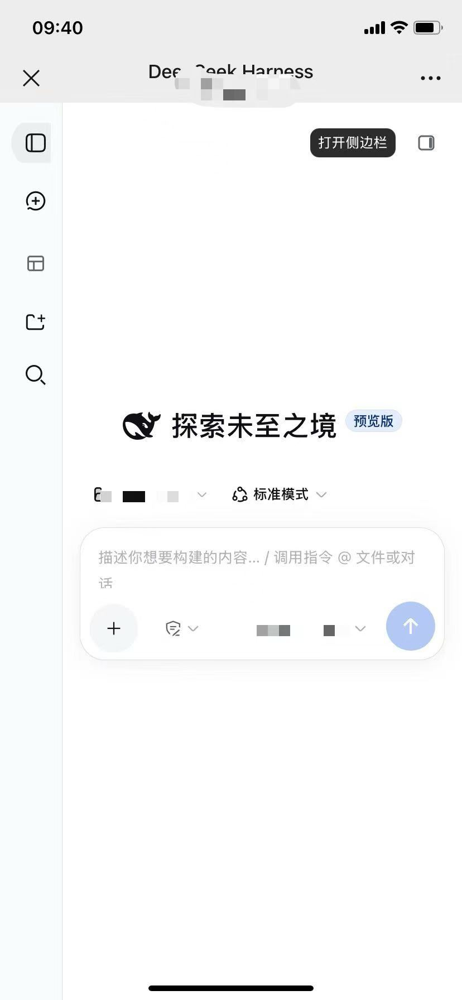

# dsh-mobile-cordis

> 手机扫码即同步访问 DSH Desktop（局域网实时同屏）

<div align="center">

**DeepSeek Harness 移动端访问插件**

通过局域网在手机上访问 DSH Desktop，实现远程对话和代码辅助

[📱 移动端预览](#-移动端预览) | [🚀 快速开始](#-使用方法) | [⚙️ 配置说明](#-配置选项)

</div>

---

## 📱 项目简介

DSH Mobile Cordis 是一个为 DeepSeek Harness Desktop 设计的 Cordis 插件，让你可以在手机上通过局域网访问 DSH Desktop 界面。

无需复杂的配置，只需扫描二维码即可在移动设备上继续你的编程对话，享受灵活的跨设备工作体验。

### ✨ 主要特性

- 📱 **扫码连接** - 扫描二维码快速访问，无需手动输入地址
- 🔄 **实时同步** - WebSocket 透明代理，对话内容实时同步
- 🌐 **局域网访问** - 在同一 WiFi 网络下即可使用
- 🎛️ **手动开关** - 随时启用/禁用移动端访问服务
- 🔒 **PIN 验证** - 可选的 PIN 码保护（配置启用）
- 📊 **状态监控** - 实时显示连接状态和服务信息
- 🎨 **中文界面** - 完整的中文 UI 支持
- 📡 **IP 自动检测** - 自动检测局域网 IP（支持手动覆盖）

## 🖼️ 移动端预览

<div align="center">
  
  <br/>
  <em>DSH Mobile 移动端界面 - 在手机上继续你的编程对话</em>
</div>

DeepSeek Harness Cordis plugin that enables mobile phone access to the DSH desktop web interface via QR code scanning over LAN.

## 🚀 使用方法

### 安装

#### 方法一：从 GitHub 安装（推荐）

```bash
dsh plugin install github:leadme96/dsh-mobile-cordis --profile desktop
```

#### 方法二：本地安装

```bash
# 克隆仓库
git clone https://github.com/leadme96/dsh-mobile-cordis.git

# 本地安装
dsh plugin install file:/path/to/dsh-mobile-cordis --profile desktop
```

### 使用步骤

1. **启用插件**
   - 打开 DSH Desktop 设置
   - 进入「移动端访问」选项卡
   - 点击开关启用服务

2. **连接手机**
   - 确保手机与电脑在同一 WiFi 网络
   - 使用手机扫描设置面板中的二维码
   - 或手动输入显示的访问地址

3. **开始使用**
   - 在手机上继续你的对话
   - 查看和发送消息
   - 享受移动办公的便利

4. **终端二维码**
   - 插件启动时会在终端打印二维码
   - 也可以直接扫描终端中的二维码

## ⚙️ 配置选项

编辑 `cordis.yml` 或使用设置界面：

```yaml
- name: dsh-mobile-cordis
  config:
    enabled: true              # 启用/禁用插件
    port: 3081                 # 代理端口（监听 0.0.0.0）
    upstreamPort: 0            # DSH Web 端口（0 = 自动检测）
    lanIpOverride: ""          # 手动指定局域网 IP（空 = 自动检测）
    pinEnabled: false          # 启用 PIN 码验证
    customPin: ""              # 自定义 PIN 码（空 = 自动生成）
    heartbeatInterval: 30      # WebSocket 心跳间隔（秒，0 = 禁用）
```

### 配置说明

| 配置项 | 类型 | 默认值 | 说明 |
|--------|------|--------|------|
| `enabled` | boolean | `true` | 启用或禁用移动端访问代理 |
| `port` | number | `3081` | 代理服务器监听端口（0.0.0.0） |
| `upstreamPort` | number | `0` | DSH Web 服务器端口（0 = 自动检测） |
| `lanIpOverride` | string | `""` | 覆盖自动检测的局域网 IP（空 = 自动） |
| `pinEnabled` | boolean | `false` | 启用 PIN 码认证 |
| `customPin` | string | `""` | 自定义 8 位 PIN 码（空 = 自动生成） |
| `heartbeatInterval` | number | `30` | WebSocket 心跳间隔（秒，0 = 禁用） |

### 手动开关

除了配置文件，你还可以在 DSH Desktop 设置界面中使用开关按钮实时启用/禁用移动端访问服务：

- 🟢 **绿色开关** = 服务已启用，可以扫码访问
- 🔴 **红色开关** = 服务已禁用，停止代理服务

**状态持久化**：开关状态会自动保存到 `$DSH_HOME/dsh-mobile/state.json`，重启 DSH Desktop 后会恢复上次的状态。

## 🔧 工作原理

1. **反向代理**：插件在 `0.0.0.0:<port>` 上运行反向代理，转发请求到 `127.0.0.1:<upstreamPort>`

2. **头部重写**：所有 `Host` 和 `Origin` 头部被重写为 `127.0.0.1:<upstreamPort>`，使 DSH 的信任边界接受请求

3. **WebSocket 透明**：WebSocket 连接在 TCP 套接字级别双向管道传输，实现实时流式输出

4. **移动端适配**：代理在 HTML 响应中注入兼容性修复代码，解决非 localhost 源的兼容问题

5. **二维码生成**：生成包含局域网 URL（可选 PIN 令牌）的二维码，方便手机访问

## 🔒 安全性

- **默认仅局域网**：代理监听所有接口，但仅用于局域网访问
- **可选 PIN**：启用 `pinEnabled: true` 要求 8 位 PIN 码访问
- **会话绑定**：PIN Cookie 绑定到 DSH 会话（重启会使会话失效）
- **无公网暴露**：此插件不会将 DSH 暴露到公网（需要公网访问请使用 Cloudflare tunnels）

## 🖥️ DSH Desktop 集成

在 DSH Desktop 中运行时：
- 插件通过 `desktopProfiles` 上下文检测桌面环境
- 更新/重启控件被禁用（桌面端管理生命周期）
- 所有其他功能正常工作

## 💻 开发

```bash
# 安装依赖
pnpm install

# 构建
pnpm build

# 运行测试
pnpm test

# 类型检查
pnpm typecheck

# 代码检查
pnpm lint
```

## 🏗️ 项目结构

```
dsh-mobile-cordis/
├── src/
│   ├── index.ts        # 插件入口
│   ├── proxy.ts        # 反向代理（HTTP + WebSocket）
│   ├── service.ts      # 局域网 IP 检测 + 二维码生成
│   └── settings.ts     # PIN 持久化 + 开关状态持久化
├── client/
│   └── client.js       # 设置界面 UI
├── screenshots/        # 截图
├── test/               # 测试套件
└── cordis.patch.yml    # Cordis bundle 清单
```

## 📄 许可证

MIT

## 🙏 致谢

灵感来源于 [dsh-pocket](https://github.com/shaobeichen/dsh-pocket) — 同一概念的独立实现。

---

<div align="center">

**为 DeepSeek Harness 社区用 ❤️ 打造**

如果这个项目对你有帮助，请在 [GitHub](https://github.com/leadme96/dsh-mobile-cordis) 上给它一个 ⭐！

</div>
